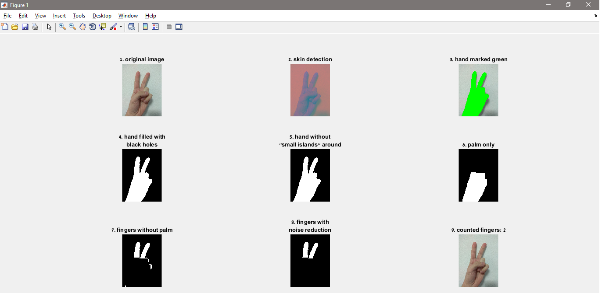
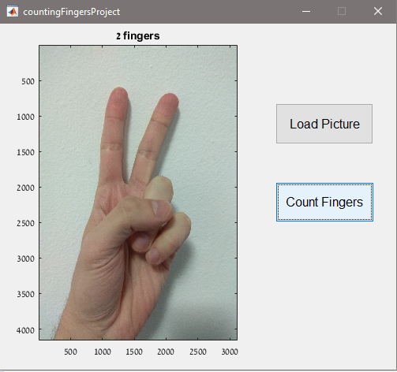

# FingerCounter
Finger detection and counting from an image.

### Usage
In this project I used a simple GUI which enables you to load an image on button press, as well as a second button to start
the process of counting the fingers from a given image.

The process of calculation might be long, during this time a figure will be opened and you will be able to see
how it's done, accompanied by pictures and text as below.

Once the process is completed, the GUI window will be on top and the loaded image will
be set with a new title which says how many fingers have been counted, as below.

